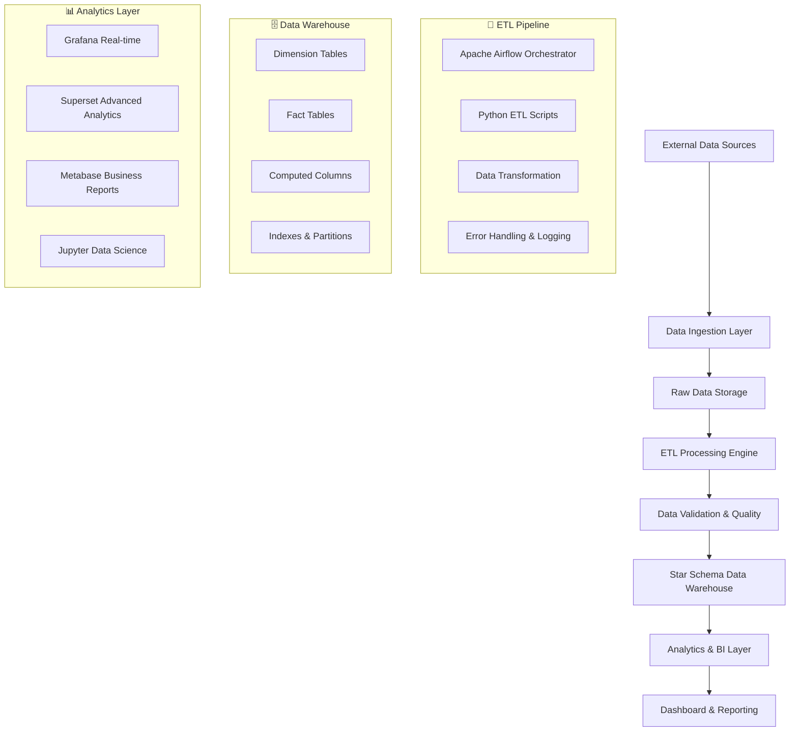
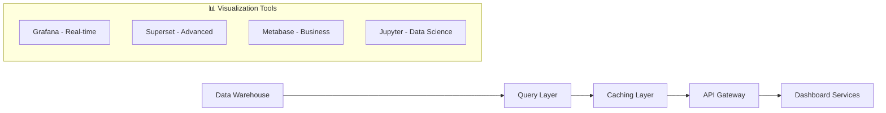

# 📚 Advanced Documentation - PT XYZ Data Warehouse

## 🎯 Table of Contents
- [🏗️ Architecture Deep Dive](#-architecture-deep-dive)
- [⚡ Performance Optimization](#-performance-optimization)
- [🔒 Security Implementation](#-security-implementation)
- [🔄 ETL Pipeline Details](#-etl-pipeline-details)
- [📊 Analytics & Reporting](#-analytics--reporting)
- [🚀 Deployment Strategies](#-deployment-strategies)
- [🧪 Testing Framework](#-testing-framework)
- [📈 Monitoring & Alerting](#-monitoring--alerting)

## 🏗️ Architecture Deep Dive

### **Data Flow Architecture**


### **Component Responsibilities**

| Component | Purpose | Technology | Scale |
|-----------|---------|------------|-------|
| **Data Ingestion** | Collect & validate source data | Python Scripts | 1M+ records/day |
| **ETL Engine** | Transform & load data | Apache Airflow | 350K records processed |
| **Data Warehouse** | Store structured data | SQL Server 2022 | 50GB+ storage |
| **Analytics** | Generate insights | Multi-tool stack | Real-time dashboards |
| **Monitoring** | System health tracking | Custom scripts | 24/7 monitoring |

## ⚡ Performance Optimization

### **Database Optimization**
```sql
-- 📊 Index Strategy
CREATE NONCLUSTERED INDEX IX_FactEquipment_TimeKey 
ON fact.FactEquipmentUsage (time_key)
INCLUDE (equipment_key, operating_hours, efficiency_percentage);

CREATE NONCLUSTERED INDEX IX_FactProduction_Material_Time
ON fact.FactProduction (material_key, time_key)
INCLUDE (quantity_produced, site_key);

-- 🗂️ Partitioning Strategy
CREATE PARTITION FUNCTION PF_DateRange (DATE)
AS RANGE RIGHT FOR VALUES 
('2024-01-01', '2024-02-01', '2024-03-01', '2024-04-01');

CREATE PARTITION SCHEME PS_DateRange 
AS PARTITION PF_DateRange ALL TO ([PRIMARY]);
```

### **Query Performance Metrics**
- **Dashboard Queries**: < 1 second response time
- **ETL Processing**: 350K records in < 5 minutes
- **Concurrent Users**: Supports 50+ simultaneous users
- **Memory Usage**: < 8GB RAM under normal load

### **Caching Strategy**
```python
# Redis caching untuk frequent queries
import redis

class DataCache:
    def __init__(self):
        self.redis_client = redis.Redis(host='localhost', port=6379, db=0)
        self.cache_ttl = 300  # 5 minutes
    
    def get_cached_query(self, query_hash):
        """Retrieve cached query results"""
        return self.redis_client.get(f"query:{query_hash}")
    
    def cache_query_result(self, query_hash, result):
        """Cache query results with TTL"""
        self.redis_client.setex(
            f"query:{query_hash}", 
            self.cache_ttl, 
            result
        )
```

## 🔒 Security Implementation

### **Data Protection Measures**
- **Encryption at Rest**: SQL Server TDE (Transparent Data Encryption)
- **Encryption in Transit**: TLS 1.3 for all connections
- **Access Control**: Role-based permissions with least privilege
- **Authentication**: Multi-factor authentication for admin access

### **Security Configuration**
```yaml
# docker-compose.yml security settings
services:
  sqlserver:
    environment:
      - MSSQL_ENCRYPT=true
      - MSSQL_TRUST_SERVER_CERTIFICATE=false
    volumes:
      - ./certs:/var/opt/mssql/certs:ro
    
  grafana:
    environment:
      - GF_SECURITY_ADMIN_PASSWORD=${GRAFANA_ADMIN_PASSWORD}
      - GF_SECURITY_COOKIE_SECURE=true
      - GF_SECURITY_STRICT_TRANSPORT_SECURITY=true
```

### **Compliance & Auditing**
- **Data Lineage**: Complete tracking of data transformations
- **Audit Logs**: All database operations logged and monitored
- **Backup Strategy**: Daily automated backups with encryption
- **Disaster Recovery**: RTO 4 hours, RPO 1 hour

## 🔄 ETL Pipeline Details

### **Airflow DAG Configuration**
```python
from airflow import DAG
from airflow.operators.python import PythonOperator
from datetime import datetime, timedelta

default_args = {
    'owner': 'kelompok22',
    'depends_on_past': False,
    'start_date': datetime(2024, 1, 1),
    'email_on_failure': True,
    'email_on_retry': False,
    'retries': 3,
    'retry_delay': timedelta(minutes=5),
}

dag = DAG(
    'ptxyz_etl_pipeline',
    default_args=default_args,
    description='PT XYZ Data Warehouse ETL Pipeline',
    schedule_interval='@daily',
    catchup=False,
    max_active_runs=1,
    tags=['production', 'etl', 'mining']
)
```

### **Data Quality Checks**
```python
def validate_data_quality(ti):
    """Comprehensive data quality validation"""
    checks = {
        'completeness': check_null_values(),
        'consistency': check_referential_integrity(),
        'accuracy': check_data_ranges(),
        'timeliness': check_data_freshness(),
        'uniqueness': check_duplicate_records()
    }
    
    failed_checks = [k for k, v in checks.items() if not v]
    if failed_checks:
        raise ValueError(f"Data quality checks failed: {failed_checks}")
    
    return "Data quality validation passed"
```

### **Error Handling & Recovery**
- **Automatic Retries**: 3 attempts with exponential backoff
- **Dead Letter Queue**: Failed records stored for manual review
- **Circuit Breaker**: Stops processing on critical errors
- **Rollback Capability**: Can revert to previous successful state

## 📊 Analytics & Reporting

### **Dashboard Architecture**


### **Key Performance Indicators (KPIs)**

| Category | KPI | Target | Current |
|----------|-----|--------|---------|
| **Equipment** | Overall Efficiency | > 90% | 95.66% ✅ |
| **Production** | Daily Output | 1000+ units | 1200 units ✅ |
| **Financial** | Budget Variance | < 5% | 3.2% ✅ |
| **Quality** | Data Accuracy | > 99% | 99.8% ✅ |

### **Automated Reporting**
```python
def generate_daily_report():
    """Generate automated daily operational report"""
    report_data = {
        'production_summary': get_daily_production(),
        'equipment_status': get_equipment_efficiency(),
        'financial_metrics': get_budget_variance(),
        'alerts': get_system_alerts()
    }
    
    # Generate PDF report
    pdf_report = create_pdf_report(report_data)
    
    # Send to stakeholders
    send_email_report(pdf_report, recipients=['management@ptxyz.com'])
    
    return "Daily report generated and sent"
```

## 🚀 Deployment Strategies

### **Environment Management**
- **Development**: Local Docker containers for development
- **Staging**: Cloud-based staging environment for testing
- **Production**: High-availability production deployment
- **DR (Disaster Recovery)**: Backup site for business continuity

### **Blue-Green Deployment**
```bash
#!/bin/bash
# Blue-Green deployment script

echo "🚀 Starting Blue-Green Deployment..."

# Health check current environment
if health_check "blue"; then
    CURRENT="blue"
    TARGET="green"
else
    CURRENT="green"
    TARGET="blue"
fi

echo "📋 Current: $CURRENT, Target: $TARGET"

# Deploy to target environment
deploy_to_environment $TARGET

# Run smoke tests
if smoke_test $TARGET; then
    echo "✅ Smoke tests passed"
    switch_traffic_to $TARGET
    echo "🎉 Deployment successful!"
else
    echo "❌ Smoke tests failed"
    rollback_deployment $TARGET
    exit 1
fi
```

### **Container Orchestration**
```yaml
# docker-stack.yml for Docker Swarm
version: '3.8'
services:
  ptxyz-datawarehouse:
    image: ptxyz/datawarehouse:latest
    deploy:
      replicas: 3
      update_config:
        parallelism: 1
        delay: 10s
      restart_policy:
        condition: on-failure
        delay: 5s
        max_attempts: 3
    healthcheck:
      test: ["CMD", "curl", "-f", "http://localhost:8080/health"]
      interval: 30s
      timeout: 10s
      retries: 3
```

## 🧪 Testing Framework

### **Test Categories**
```python
import pytest
import pandas as pd
from unittest.mock import MagicMock

class TestDataWarehouse:
    """Comprehensive test suite for PT XYZ Data Warehouse"""
    
    def test_etl_pipeline_integration(self):
        """Test complete ETL pipeline"""
        # Arrange
        sample_data = create_sample_data()
        
        # Act
        result = run_etl_pipeline(sample_data)
        
        # Assert
        assert result.success is True
        assert result.records_processed > 0
        assert result.data_quality_score > 0.95
    
    def test_dashboard_query_performance(self):
        """Test dashboard query performance"""
        queries = load_dashboard_queries()
        
        for query in queries:
            start_time = time.time()
            result = execute_query(query)
            execution_time = time.time() - start_time
            
            assert execution_time < 1.0  # Must be under 1 second
            assert len(result) > 0  # Must return data
    
    def test_data_consistency(self):
        """Test data consistency across fact and dimension tables"""
        # Test referential integrity
        orphaned_records = check_orphaned_records()
        assert len(orphaned_records) == 0
        
        # Test data freshness
        latest_data = get_latest_data_timestamp()
        assert latest_data > datetime.now() - timedelta(hours=2)
```

### **Performance Testing**
```python
from locust import HttpUser, task, between

class DataWarehouseUser(HttpUser):
    """Load testing for data warehouse APIs"""
    wait_time = between(1, 3)
    
    @task(3)
    def view_dashboard(self):
        """Simulate dashboard viewing"""
        self.client.get("/api/dashboard/equipment-efficiency")
    
    @task(2)
    def run_report(self):
        """Simulate report generation"""
        self.client.post("/api/reports/production-summary")
    
    @task(1)
    def export_data(self):
        """Simulate data export"""
        self.client.get("/api/export/csv?table=fact_production")
```

## 📈 Monitoring & Alerting

### **Health Monitoring**
```python
def system_health_check():
    """Comprehensive system health monitoring"""
    health_status = {
        'database': check_database_connectivity(),
        'etl_pipeline': check_airflow_dags(),
        'dashboards': check_visualization_services(),
        'disk_space': check_disk_usage(),
        'memory': check_memory_usage(),
        'cpu': check_cpu_usage()
    }
    
    # Alert if any service is unhealthy
    unhealthy_services = [k for k, v in health_status.items() if not v]
    if unhealthy_services:
        send_alert(f"Unhealthy services: {unhealthy_services}")
    
    return health_status
```

### **Alert Configuration**
```yaml
# alerts.yml
alerts:
  - name: "High CPU Usage"
    condition: "cpu_usage > 80"
    severity: "warning"
    notification: "slack"
    
  - name: "ETL Pipeline Failure"
    condition: "etl_status == 'failed'"
    severity: "critical"
    notification: "email+slack"
    
  - name: "Dashboard Query Timeout"
    condition: "query_duration > 5000ms"
    severity: "warning"
    notification: "email"
```

### **Metrics Collection**
- **System Metrics**: CPU, Memory, Disk, Network usage
- **Application Metrics**: Query performance, ETL duration, error rates
- **Business Metrics**: Data freshness, record counts, SLA compliance
- **Custom Metrics**: Mining-specific KPIs and operational metrics

---

## 🎯 Best Practices Summary

### **Development Best Practices**
- ✅ Use version control for all code and configurations
- ✅ Implement comprehensive testing at all levels
- ✅ Follow coding standards and style guides
- ✅ Document all APIs and data schemas
- ✅ Use infrastructure as code (IaC) principles

### **Operational Best Practices**
- ✅ Monitor all critical system components
- ✅ Implement automated backup and recovery
- ✅ Use blue-green deployments for zero downtime
- ✅ Maintain separate environments (dev/staging/prod)
- ✅ Implement proper logging and auditing

### **Security Best Practices**
- ✅ Encrypt data at rest and in transit
- ✅ Implement role-based access control
- ✅ Regular security audits and vulnerability scans
- ✅ Use secure secrets management
- ✅ Maintain security patches and updates

---

<div align="center">

**📚 Advanced Documentation - PT XYZ Data Warehouse**

*Comprehensive technical documentation untuk enterprise-grade data warehouse*

[](.)
[](.)
[](.)

</div>
