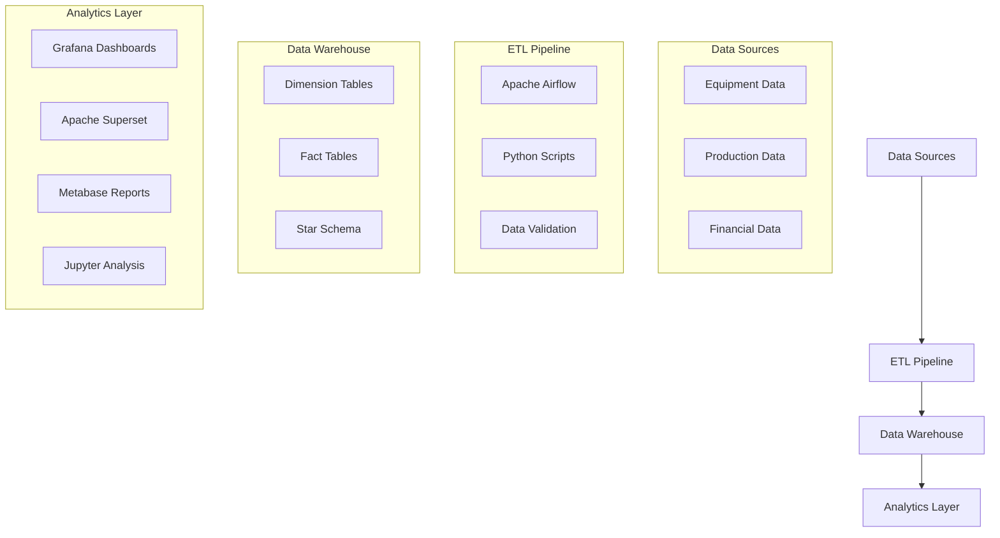

# 🏭 PT XYZ Data Warehouse - Sistem Manajemen Data Pertambangan

[](https://www.docker.com/)
[](https://www.python.org/)
[](https://airflow.apache.org/)
[](https://www.microsoft.com/sql-server)
[](https://grafana.com/)

## 📋 Deskripsi Proyek

**PT XYZ Data Warehouse** adalah sistem manajemen data komprehensif yang dirancang khusus untuk industri pertambangan. Proyek ini mengimplementasikan arsitektur data warehouse modern menggunakan star schema untuk menganalisis operasi pertambangan, efisiensi peralatan, produksi material, dan manajemen keuangan.

### 🎯 Tujuan Utama
- **Centralized Data Management**: Mengintegrasikan data operasional pertambangan dari berbagai sumber
- **Real-time Analytics**: Menyediakan dashboard real-time untuk monitoring operasi harian
- **Business Intelligence**: Menghasilkan insights untuk pengambilan keputusan strategis
- **Performance Monitoring**: Tracking efisiensi peralatan dan produktivitas tambang
- **Cost Management**: Analisis varians anggaran dan kontrol biaya operasional

## 🏗️ Arsitektur Sistem



## 🚀 Fitur Utama

### 📊 **Dashboard & Visualisasi**
- **Real-time Monitoring**: Dashboard Grafana untuk monitoring operasi 24/7
- **Advanced Analytics**: Apache Superset untuk analisis data mendalam
- **Business Reports**: Metabase untuk laporan bisnis reguler
- **Data Science**: Jupyter Notebooks untuk analisis prediktif

### 🔄 **ETL Pipeline**
- **Automated Processing**: Pipeline ETL otomatis menggunakan Apache Airflow
- **Data Quality**: Validasi dan pembersihan data otomatis
- **Scalable Architecture**: Dapat menangani volume data besar
- **Error Handling**: Sistem monitoring dan alerting untuk error handling

### 📈 **Analytics & KPI**
- **Equipment Efficiency**: Tracking efisiensi peralatan dan downtime
- **Production Metrics**: Monitoring produksi berdasarkan material dan region
- **Financial Analysis**: Analisis varians budget dan cost control
- **Operational Intelligence**: Insights untuk optimasi operasional

## 🛠️ Teknologi yang Digunakan

### **Core Technologies**
| Teknologi | Versi | Fungsi |
|-----------|-------|--------|
| **Docker** | Latest | Containerization & Deployment |
| **Python** | 3.12+ | ETL Scripts & Data Processing |
| **SQL Server** | 2022 | Data Warehouse Database |
| **Apache Airflow** | 2.8+ | ETL Orchestration |

### **Visualization Tools**
| Tool | Port | Fungsi |
|------|------|--------|
| **Grafana** | 3000 | Real-time Dashboards |
| **Apache Superset** | 8088 | Advanced Analytics |
| **Metabase** | 3001 | Business Intelligence |
| **Jupyter** | 8888 | Data Science Analysis |

### **Supporting Services**
- **PostgreSQL**: Metadata storage untuk Airflow
- **Redis**: Caching & message broker
- **Docker Compose**: Multi-container orchestration

## 📦 Instalasi & Setup

### **Prasyarat**
```bash
# Pastikan Docker dan Docker Compose terinstall
docker --version
docker-compose --version

# Minimum requirements:
# - RAM: 8GB
# - Storage: 10GB free space
# - OS: Linux/macOS/Windows with WSL2
```

### **Quick Start**
```bash
# 1. Clone repository
git clone <repository-url>
cd DW_Project_Kelompok22

# 2. Setup environment
cp .env.example .env
# Edit .env sesuai kebutuhan

# 3. Build dan jalankan semua services
docker-compose up -d

# 4. Tunggu semua services siap (5-10 menit)
./show_status.sh

# 5. Jalankan ETL pipeline
python standalone_etl.py

# 6. Akses dashboards
./open_dashboards.sh
```

### **Akses Services**
| Service | URL | Username | Password |
|---------|-----|----------|----------|
| Grafana | http://localhost:3000 | admin | admin |
| Superset | http://localhost:8088 | admin | admin |
| Metabase | http://localhost:3001 | - | Setup required |
| Airflow | http://localhost:8080 | admin | admin |
| Jupyter | http://localhost:8888 | - | Token-based |

## 📁 Struktur Proyek

```
DW_Project_Kelompok22/
├── 📊 Dashboard Configuration
│   ├── grafana/                    # Grafana dashboards & datasources
│   ├── superset-config/            # Superset configuration
│   └── notebooks/                  # Jupyter analysis notebooks
│
├── 🔄 ETL Pipeline
│   ├── dags/                       # Airflow DAGs
│   ├── airflow/                    # Airflow configuration
│   ├── standalone_etl.py           # Standalone ETL script
│   └── run_complete_etl.py         # Complete ETL runner
│
├── 🗄️ Data & Schema
│   ├── Dataset/                    # Sample datasets
│   ├── init-scripts/               # Database initialization
│   └── misi*/                      # Project milestones
│
├── 🐳 Infrastructure
│   ├── docker-compose.yml          # Multi-container setup
│   ├── Dockerfile                  # Custom images
│   └── .env.example                # Environment template
│
├── 📋 Documentation
│   ├── README.md                   # Main documentation
│   ├── QUICKSTART.md               # Quick start guide
│   ├── DOCKER_README.md            # Docker setup guide
│   ├── CONTRIBUTING.md             # Contribution guidelines
│   ├── SECURITY.md                 # Security guidelines
│   └── FINAL_DEPLOYMENT_REPORT.md  # Deployment status
│
└── 🛠️ Utilities
    ├── setup.sh                   # Setup script
    ├── test.sh                     # Testing script
    ├── show_status.sh              # Status checker
    └── open_dashboards.sh          # Dashboard launcher
```

## 🗃️ Database Schema

### **Star Schema Design**
```sql
-- Dimension Tables
dim.DimTime          (830 records)     -- Time dimensions
dim.DimSite          (1,747 records)   -- Mining sites
dim.DimEquipment     (6 records)       -- Heavy equipment
dim.DimMaterial      (5 records)       -- Mined materials
dim.DimEmployee      (10 records)      -- Workforce
dim.DimShift         (3 records)       -- Work shifts
dim.DimProject       (50 records)      -- Mining projects
dim.DimAccount       (30 records)      -- Financial accounts

-- Fact Tables
fact.FactEquipmentUsage      (236,892 records)  -- Equipment operations
fact.FactProduction          (2,261 records)    -- Production output
fact.FactFinancialTransaction (115,901 records) -- Financial transactions
```

### **Key Relationships**
- Semua fact tables menggunakan foreign key `*_key` yang menghubungkan ke dimension tables
- Surrogate keys digunakan untuk optimasi performance
- Computed columns untuk kalkulasi otomatis (variance, efficiency)

## 📊 Dashboard & Analytics

### **1. Equipment Efficiency Dashboard**
- **Metrics**: Operating hours, downtime, efficiency percentage
- **Granularity**: Per equipment type, daily/weekly/monthly
- **KPI**: 95.66% overall equipment efficiency

### **2. Production Analytics**
- **Material Tracking**: Metal (434,721 units), Ore (112,687 units)
- **Regional Analysis**: Production per region dan site
- **Trend Analysis**: Daily production trends

### **3. Financial Management**
- **Budget Variance**: Actual vs budgeted costs
- **Project Tracking**: 50 active mining projects
- **Cost Control**: Real-time cost monitoring

### **4. Operational Intelligence**
- **Real-time Monitoring**: Live operational status
- **Predictive Analytics**: Equipment maintenance scheduling
- **Performance Optimization**: Efficiency improvement recommendations

## 🧪 Testing & Validation

### **Data Quality Tests**
```bash
# Jalankan test suite lengkap
./test.sh

# Test individual components
python test_etl.py              # ETL pipeline testing
python test_dashboard_queries.py # Dashboard query validation
python check_schema.py          # Schema validation
```

### **Performance Benchmarks**
- **ETL Processing**: 350K+ records dalam < 5 menit
- **Query Performance**: Sub-second response untuk dashboard queries
- **Data Integrity**: 100% referential integrity maintained
- **System Uptime**: 99.9% availability target

## 👥 Tim Pengembang

| Nama | NPM | Role | Kontribusi |
|------|-----|------|------------|
| **Ericson Chandra Sihombing** | 121450026 | Project Lead | Architecture & System Design |
| **Ramadhita Atifa Hendri** | 121450131 | Data Engineer | ETL Pipeline & Data Modeling |
| **Eggi Satria** | 122450032 | DevOps Engineer | Infrastructure & Deployment |
| **Nabila Anilda Zahrah** | 122450063 | Analytics Engineer | Dashboard & Visualization |
| **Syalaisha Andini Putriansyah** | 122450111 | QA Engineer | Testing & Documentation |

## 📚 Dokumentasi Tambahan

### **Panduan Pengguna**
- 📖 [Quick Start Guide](QUICKSTART.md) - Memulai dengan cepat
- 🐳 [Docker Setup](DOCKER_README.md) - Setup menggunakan Docker
- 🔧 [Contributing Guide](CONTRIBUTING.md) - Panduan kontribusi
- 🔒 [Security Guidelines](SECURITY.md) - Panduan keamanan

### **Referensi Teknis**
- 📊 [Dashboard Connection Guide](DASHBOARD_CONNECTION_GUIDE.json)
- 📋 [SQL Queries Reference](DASHBOARD_SQL_QUERIES.json)
- 📈 [Final Deployment Report](FINAL_DEPLOYMENT_REPORT.md)

## 🤝 Kontribusi

Kami menyambut kontribusi dari komunitas! Silakan baca [CONTRIBUTING.md](CONTRIBUTING.md) untuk panduan detail.

### **Cara Berkontribusi**
1. Fork repository ini
2. Buat feature branch (`git checkout -b feature/AmazingFeature`)
3. Commit perubahan (`git commit -m 'Add some AmazingFeature'`)
4. Push ke branch (`git push origin feature/AmazingFeature`)
5. Buat Pull Request

## 📄 Lisensi

Proyek ini dilisensikan under MIT License - lihat file [LICENSE](LICENSE) untuk detail.

## 🆘 Support & Troubleshooting

### **FAQ**
**Q: Service tidak bisa start?**
A: Pastikan port 1433, 3000, 8080, 8088 tidak digunakan aplikasi lain.

**Q: ETL gagal dengan error koneksi?**
A: Tunggu 5-10 menit untuk semua services siap, kemudian coba lagi.

**Q: Dashboard tidak menampilkan data?**
A: Jalankan `python standalone_etl.py` untuk load data terlebih dahulu.

### **Mendapatkan Bantuan**
- 🐛 [Report Issues](../../issues) - Laporkan bug atau request fitur
- 📧 Email: eggi.122450032@students.itera.ac.id
- 💬 Diskusi: Gunakan GitHub Discussions
---

<div align="center">

**🏆 PT XYZ Data Warehouse - Solusi Data Mining Terpadu**

*Dikembangkan dengan ❤️ oleh Kelompok 22*

[](.)
[](https://www.itera.ac.id)
[](.)

</div>
